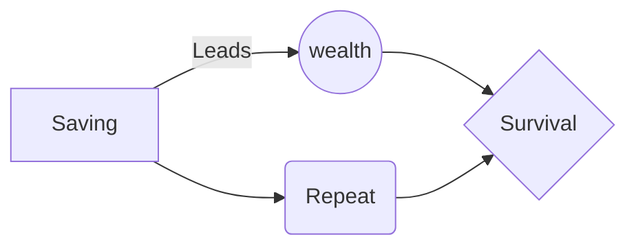

**

> You must save money or else you will die poor!”

**

or “You better study hard and find a good job, otherwise how to be rich like that?!”

Thinking back, we laugh at it now. But there is some truth to it. Why are we NOT rich, NOT wealthy, and do NOT have the financial independence we all talk so much about, but have NOT achieved for some elusive reason?

The answer is simple; we have been conditioned to believe that studying as hard as possible and working inhumane hours are key indicators of our success. We have been conditioned to believe that saving and accumulating as much wealth as possible is the only way for us to be rich.

We couldn’t be more wrong.

What we need to do, is to stop focusing on Wealth Accumulation, and instead focus on Wealth Creation. Here are 3 reasons why saving will never help you be rich:

**1) The Battle Is Never In Your Favor**

This year, MAS Core Inflation is expected to rise by 1% – 2%. For most savings accounts, you’re earning an interest rate of an average of 0.1%. This means that you are continuously losing money. If you have been saving money for years, or decades even, how does it feel to know it has not been helping?

Don’t be mistaken; saving is a great practice and should be encouraged, but you have to first understand that by only saving, you are losing battle after battle, and becoming poorer in the process.

So what should you do? See below.

**2) The Wealthy Do More Than Just Save**

Ask any wealthy person you know. Did they become rich by simply setting aside a fraction of their income and depositing it in the bank, or did they use their money to work for them?

Ordinary people save to spend. Wealthy people save to leverage.

Ordinary people chase trends and spend thousands of dollars if not more, to be “cool”. Wealthy people invest through properties, commodities, or the stock exchange.

See the difference?

**3) Money is just metal and paper**

You have to look at money for what it truly is; a medium of exchange. Real wealth is not having as much money as possible. Real wealth building is having as many assets as possible. Your aim should be to acquire assets, to invest, and to increase your overall cash flow.

How do we know what is an asset and what isn’t? Simple.

If it’s making you money, it’s an asset. If not, it’s a liability. The HDB you’re living in now, which you’re probably still paying mortgage for. Are you making any money from it? Are you making money from the ownership of your car? Are your investments making you enough to overcome inflation?

One of our shortcomings is that most of us fail to look at the bigger picture and the long term consequences of our actions. You save today, but can you survive tomorrow? Save to invest, not as a means to an end.
And this will produce a flow chart:

